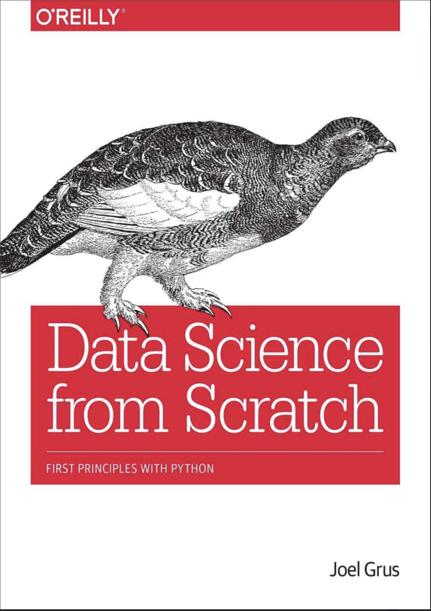

Трек для развития в сфере MLE. Полный путь: от базовой теории до продвинутых MLOps–практик и построения продакшн-ML систем. Автор https://t.me/aesthetic_mlops. Материалы будут пополняться

# Книги 
1. 

## python

  

    [{:width="250px"}](https://drive.google.com/file/d/1DiCdEa6WdDpaDlDJtPxA-c86FzxQNSIc/view?usp=sharing)
    
Подпись 1

  

  

    [{:width="250px"}](https://drive.google.com/file/d/1CcKwUG8shchXGwOLNlvPKW0utxDyXWyK/view?usp=sharing)
    
Подпись 2

  

  

    
    
Подпись 3

  

## DS

### Рекомендательные системы

[{:width="250px"}](https://drive.google.com/file/d/1LNT5JWjlJWROKsN8O6L6RiOe8KyYakTR/view?usp=sharing) 